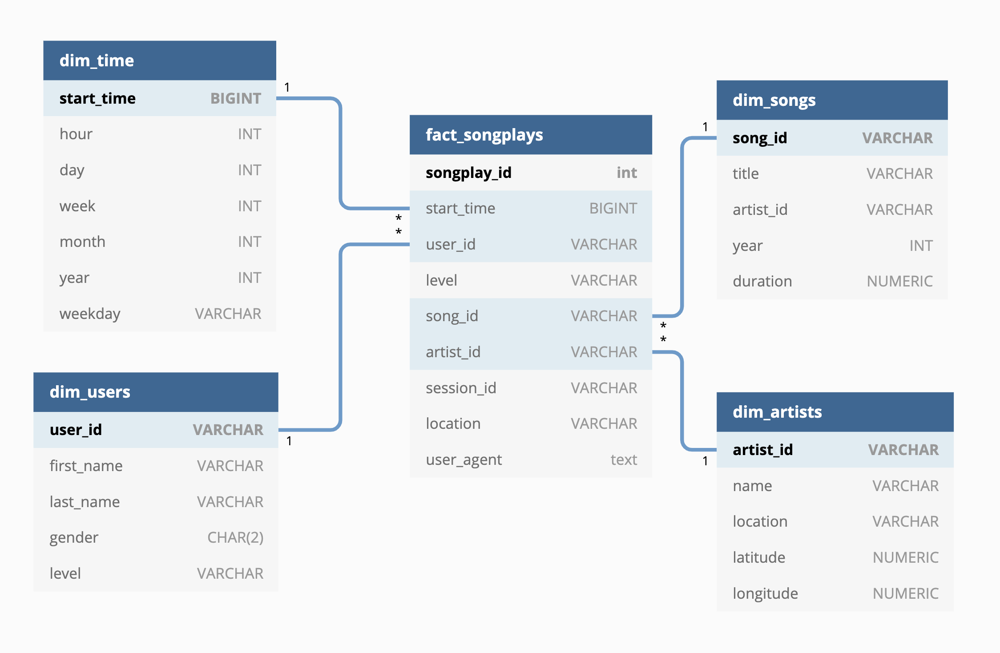

## Overview
To enable Sparkify analysing their data efficiently and fast, a data-pipeline has been built. It processes json files containing master data about songs and artists as well as log data summarising user behaviour.  
The resulting Database is designed to give rapid answers to different analytical questions about user behaviour and the importance of songs and artists.  

Technology wise the project stores the final tables as parquet files in S3 and uses Python for constructing the pipeline. The source data is located in an Amazon S3 bucket.


## Database
The Database consists of 1 Fact and 4 Dimension Tables. The Tables have a prefix dim/fact in order to be able to recognise their purpose directly. 




## Project Structure
The project consists of source data and the main python file called etl.py


## How to run
- The created python scripts can be executed from the Command Line
- Before populating the data to the Database Tables, it is necessary to initialize the Database Schema:


* the ETL script can be executed like:


```bash
root@ea782631e04c:/home/workspace# python etl.py
```


## Analytical Queries
- Get the amount of times a song has been played
```sql
SELECT s.title, COUNT(f.songplay_id) 
FROM songplays AS f 
JOIN songs AS s ON f.song_id = s.song_id 
GROUP BY s.title
```


- Get the 5 most active users 
```sql
SELECT u.first_name, u.last_name, COUNT(f.songplay_id) activity_count 
FROM songplays AS f 
JOIN users AS u ON f.user_id = u.user_id 
GROUP BY u.first_name, u.last_name 
ORDER BY COUNT(f.songplay_id) DESC
LIMIT 5
```


- Popular artists
```sql
SELECT a.name, 
COUNT(f.songplay_id) 
FROM songplays AS f 
JOIN artists AS a ON f.artist_id = a.artist_id 
GROUP BY a.name 
ORDER BY COUNT(f.songplay_id) DESC 
LIMIT 5
```